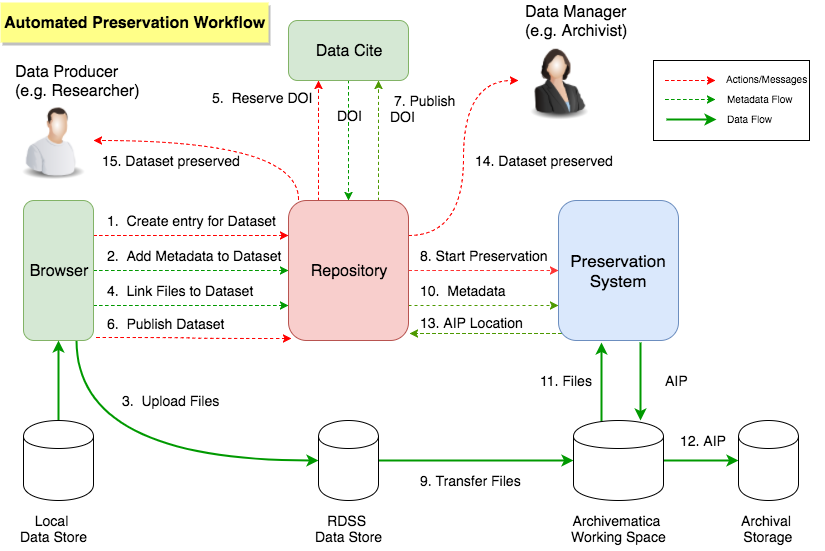

# MVP Automated Preservation Workflow

The conceptual workflow below shows how digital preservation can be used in an automated way as part of the RDSS Alpha.  Whilst the diagram and description show a Repository and Preservation System, in practice other components of the RDSS will come into play, for example databases and messaging systems that mediate the interactions between parts of the RDSS and other User Interfaces that provide Researchers and Research Managers with ways in which to interact with the RDSS.  These extra components and user interfaces are omitted from the diagram for the sake of clarity - our objective is to explain the overall workflow at a conceptual level rather than dive into too many details.

### Dataset upload and publication stage

* The Data Producer creates an entry for a Dataset in the Repository. [1]

* The Data Producer adds metadata to the Dataset (e.g. title, subject, date, author etc.). [2]

* The Data Producer uses their browser to upload Files that are part of the Dataset. [3]

* The Data Producer links the uploaded Files to the Dataset. [4]

* The Data Producer reserves a DOI for the Dataset, e.g. using DataCite. [5]

* The DOI is included in the research paper publication.

* The paper is published, e.g. in a journal.

* The Journal publishing the paper gives the paper a DOI.

* The Data Producer updates the Dataset to add the DOI of the paper as extra metadata. [repeat 2]

* The Data Producer tells the Repository to 'publish' the Dataset, i.e. make it publicly accessible over the Internet. [6]

* The DOI is made public. [7]

The Data Producer is happy now that their Dataset and publication are online and can be seen by the community.

### Dataset preservation stage

* The Preservation Systems is notified that there is a new Dataset to be processed. [8]

* The Preservation System transfers the Files from the Jisc RDSS storage to Archivematica's working storage so they are ready to be processed. [9]

* The Metadata for the Dataset is transferred to the Preservation System. [10]

* The Files are loaded into Archivematica and go through Archivematica's preservation pipeline. [11]

* Archivematica generates an Archival Information Package (AIP).  More details of the workflow supported inside Archivematica can be found on the Digital Preservation Capabilities page.

* At the end of the preservation process, the AIP is transferred to Archival Storage for long-term safekeeping. [12]

* The Repository is updated with the location of the AIP. [13]

* The Data Manager is notified that preservation is complete and the archival version of the Dataset is safely stored. [14]

* The Data Producer is notified that the Dataset has undergone preservation.  The Data Producer can view the contents if they wish. [15]

 
The Data Manager is happy knowing that the Dataset has been automatically preserved.  The Data Producer is happy knowing that their Dataset now has a better chance of being accessible and usable by others over the long-term.

Notes:

* The Repository could be hosted by the RDSS or it could be an Institutional Repository or a CRIS system. 

* The diagram shows direct exchange of metadata/messages between the Preservation System and the Repository.  In reality, this interaction is mediated by the Jisc RDSS Messaging System and there is no direct interaction.

* The diagram shows the Repository notifying the Data Producer and the Data Manager that preservation has been performed on the Dataset.  This may not be ready in the MVP and depends on the Repository/CRIS system involved.  The Preservation System will message the Jisc infrastructure to say that preservation is complete, but how this message ultimately gets to users is not in scope for our work in Lot 5.

* The workflow shows full automation of the preservation process.  Some institutions may want some level of interaction, e.g. to decide when a Dataset gets preserved or whether it should be processed through the 'automated' or 'interactive' preservation workflows.  The information needed by the Preservation System to make more intelligent decisions on when to process Datasets and how to process them won't be made available by the Jisc RDSS platform for the MVP.  We'll address this in the Beta.

* The workflow describes a scenario where everything works correctly and there are no errors, exceptions or need for user intervention.  In reality, digital preservation isn't a perfect world and therefore the MVP will also include a basic error handling/reporting workflow that we haven't yet documented on these pages.

### Some of the things we have planned for the Beta for the automated workflow

* Creation of DIPs and upload of these to a Repository or CRIS as the access version of the Dataset.

* Rules/policies for 'routing' Datasets between automated and interactive workflows.

* Templates/processing configurations of what preservation processes to apply to different types of Dataset.

* Preservation before Dataset publication rather than after it, e.g. as a form of Dataset QC for long-term usability.

