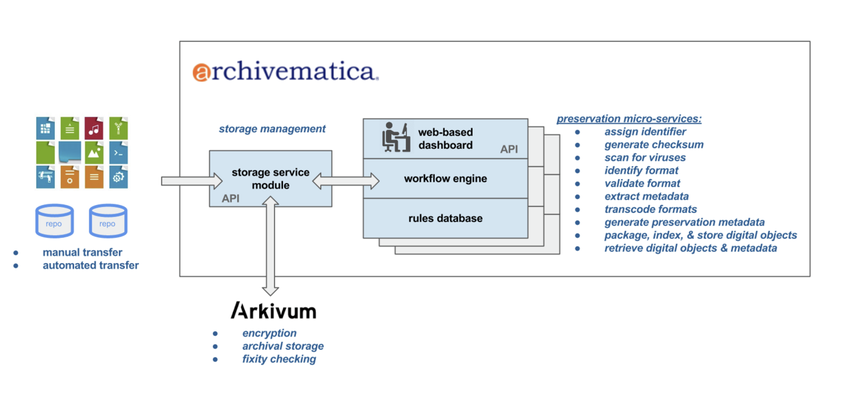
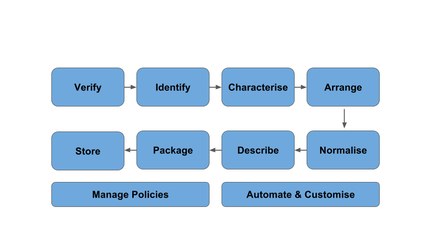

# MVP Digital Preservation Capabilities

The RDSS in Alpha phase will use version 1.6 of Archivematica, which provides a wide range of digital preservation capabilities. The initial pilot is a great opportunity for institutions to develop their understanding of preservation capabilities, best practice and opportunities for improvement or integration with research data management processes.

*Current Archivematica-Arkivum functionality/integration*

The MVP approach is to do a first-stage integration with the wider RDSS platform.  The objective is not to try to deeply embed digital preservation into the RDSS until the HEI pilots have had chance to experiment with Archivematica and its preservation capabilities.  

The breadth of configuration options and tools in Archivematica may also mean that more can be attempted inside Archivematica than is supported in the wider preservation platform.   For example, descriptive metadata can be added from within Archivematica and it can be used to create dissemination information packages (DIPs).  However, whilst DIP creation is possible in the MVP, there upload of these DIPs to external publishing systems, e.g. repositories, won't be supported.  The routing of DIPs to other parts of the RDSS will be considered in the Beta.

We encourage pIlot participants to ‘learn by doing’ and to try out Archivematica which will be enormously useful in helping Jisc, Arkivum and Artefactual to understand how to further develop the RDSS integration so it can makes the best possible use of the preservation capabilities available.   Additionally, the MVP and pilot projects will identify and prioritize new software development and R&D within the preservation platform that can improve the platforms and tools (e.g. format registries, DROID signatures).

*Archivematica internal workflow*

The diagram above summarises the key capabilities of the preservation platform:  

* **Verify** that datasets are complete and secure (e.g. through fixity checks, virus scanning and quarantine processes)

* **Identify** the types of digital objects in a dataset (e.g. file format identification and validation of conformance to standards)

* **Characterise** the digital objects being preserved (e.g. extracting additional metadata using tools that interrogate the objects themselves) so that they can be better understood or rendered later

* **Arrange** the datasets and associated metadata to improve coherence, navigation and usability 

* **Normalise** or migrate digital objects to open and widely supported standards to reduce the risk of format obsolescence 

* **Describe** the datasets with additional metadata (in open and well-used standards) so that future users can understand what has been preserved, how it can be used and that they can trust it (authenticity and provenance)

* **Package** the datasets and metadata into self-describing packages that can minimise any dependencies or reliance on repositories we use today (“AIPs"), or simplify the contents provided for access and use ("DIPs")

* **Store** multiple copies of datasets in multiple locations and different media (disc, tape) to ensure safety and security, while helping to manage the cost of long term storage

The process above can be repeated if necessary at a later date, i.e. it can be used in a cyclical way and not just as a one off.  For example, AIPs created in the past can be re-ingested and processed again in order to:

* add new metadata
* repeat file format identification and normalisation because new rules or tools become available
* create new DIPs

The core preservation capabilities are supported by underlying administration and management features: 

* **Manage policies** to codify best practices or institutional requirements and ensure consistent application of preservation rules
* **Automate and customise workflow** using automation tools (for example, specifying preservation steps that should be skipped or done in a different sequence)
