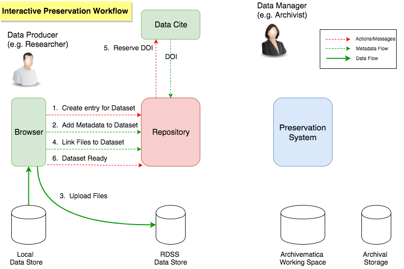
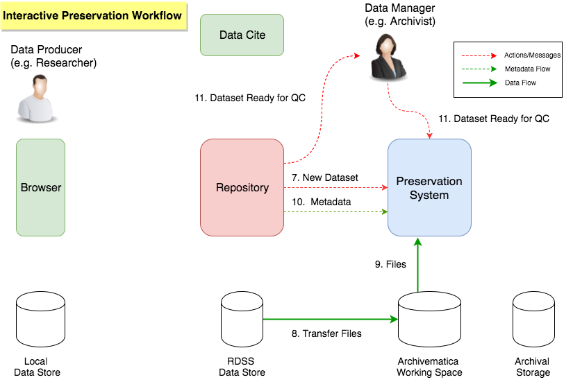
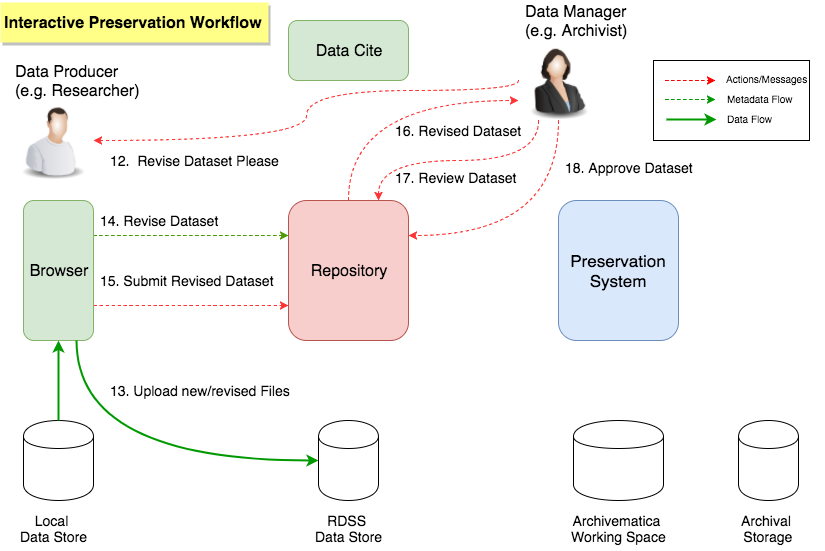
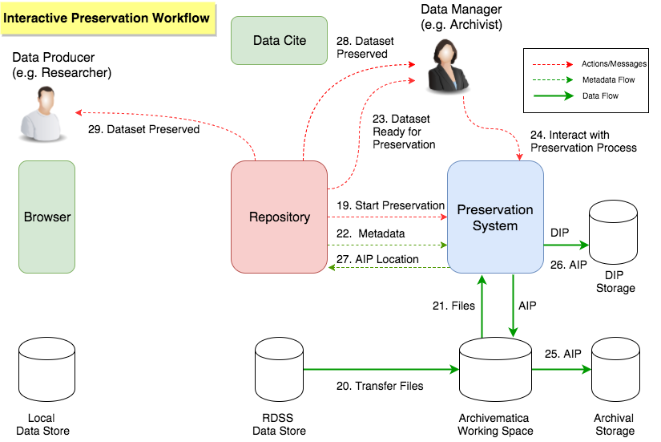
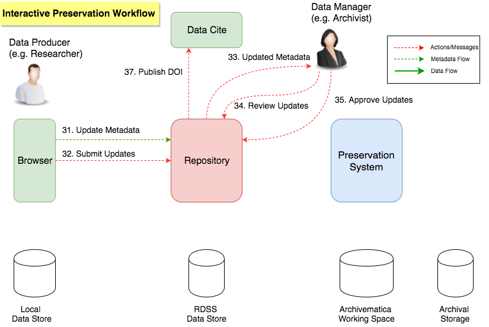
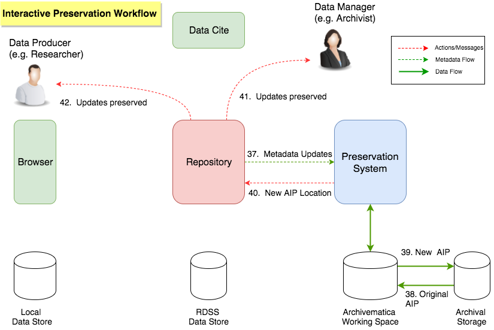

# MVP Interactive Preservation Workflow

The conceptual workflow below shows how digital preservation can be used in an interactive way as part of the RDSS Alpha.  Whilst the diagram and description show a Repository and Preservation System, in practice other components of the RDSS will come into play, for example databases and messaging systems that mediate the interactions between parts of the RDSS and other User Interfaces that provide Data Producers and Data Managers with ways in which to interact with the RDSS.  These extra components and user interfaces are omitted from the diagram for the sake of clarity - our objective is to explain the overall workflow at a conceptual level rather than dive into too many details.

Note: this workflow assumes that the Data Manager at an institution has already developed a policy and preservation plan for their Institution's Datasets, i.e. they are familiar with Archivematica's preservation planning and pipeline configuration options.  See [Digital Preservation Capabilities](MVPDigitalPreservationCapabilities.md) for more details.

**Dataset upload**

* The Data Producer creates an entry for a Dataset in the Repository. [1]

* The Data Producer adds metadata to the Dataset (e.g. title, subject, date, author etc.). [2]

* The Data Producer uses their browser to upload Files that are part of the Dataset. [3]

* The Data Producer links the uploaded Files to the Dataset. [4]

* The Data Producer reserves a DOI for the Dataset, e.g. using DataCite. [5]

* The Data Producer wants their Dataset to be made public so they can reference it in their publication, but knows it has to go through QC by their Institution first.

* The Data Producer marks the Dataset as complete and ready for QC by their Institution. [6]

**Dataset Quality Control**

The Data Producer has marked their Dataset as complete, which triggers a 'review-approve' QC process that is undertaken by the Data Manager at their Institution.

* The Preservation system is notified that a new Dataset is ready for QC. [7]

* The Preservation system transfers the Files in the Dataset to Archivematica's working space. [8]

* The Files are made accessible from within Archivematica. [9]

* The Dataset Metadata is transferred to Archivematica.  [10]

* The Data Manager is notified that there is Dataset from the Data Producer that is ready in Archivematica for review and preservation. [11]

* The Data Manager uses the Archivematica Dashboard to appraise the Files in the Dataset, e.g. to see if they are well documented and understand their file-formats. [12]

**Dataset Revision**

The Data Manager has some improvements that they would like the Data Producer to make to the Dataset, e.g. changing some of the file formats so they are open rather than proprietary and adding some explanatory notes on the contents of some of the files.

* The Data Manager tells the Data Producer that the Dataset needs revision before it can be accepted and publication will be allowed. [12]

* The Data Producer uploads new versions of some of their Files, e.g. after converting them into open-standard, open-specification, well-understood or widely-used formats. [13]

* The Data Producer updates their Dataset, which includes the new Files they uploaded and also extra documentation for some of their files that don't have an open format, e.g. describing what software to use to open the files. [14]

* The Data Producer resubmits the Dataset for review and approval by the Data Manager. [15]

* The Data Manager is notified that the Data Producer has submitted a revised Dataset. [16]

* The Data Manager inspects the revisions to see if the Data Producer has addressed the dataset issues. [17]

* The Data Manager either accepts the changes or undergoes further 'negotiation' with Data Producer (which may or may not resolve all the problems). [18]

The Research Manager decides that the Dataset is now ready for full preservation.

**Dataset Preservation**

The Data Manager has approved the Dataset and the Dataset can now go through the full preservation process.  

* The Preservation System is notified that the Dataset is ready to be processed. [19]

* The Preservation System transfers the Files from the Jisc RDSS storage to Archivematica's working storage so they are ready to be processed. [20]

* The Preservation System makes the files accessible in Archivematica. [21]

* The Metadata for the Dataset is transferred to the Preservation System. [22]

* The Data Manager is notified that the Dataset is ready for preservation. [23]

* The Data Manager interacts with the Archivematica preservation process, e.g. making decisions on whether to perform normalisation. [24]

* The Preservation System creates an AIP, which is transferred to Archival Storage for long-term safekeeping [25]

* The Preservation System creates a DIP (optional), which is transferred to a DIP store where it can be easily retrieved by the Data Manager, e.g. so they can use it as the access version of the Dataset. [26]

* The Repository is updated with the location of the AIP. [27]

* The Data Manager is notified that preservation is complete and the archival version of the Dataset is safely stored. [28]

* The Dataset is published and the reserved DOI becomes public. [29]

* The Data Producer is notified that the Dataset has undergone preservation and has been published.  The Data Producer can view the contents if they wish. [30]

**Dataset Metadata Update**

The DOI to the Dataset is included in a paper that gets published.

* The paper is published, e.g. in a journal.

* The Journal publishing the paper gives the paper a DOI.

* The Data Producer updates the Dataset to add the DOI of the paper as extra metadata.  The Data Producer adds other metadata to the Dataset, e.g. further documentation of how to use the dataset that arose from peer-review of the Dataset during the paper publication process.[31]

* The Data Producer submits the Metadata updates and requests that the Dataset DOI is made public now that the paper has been published. [32]

* The Data Manager is notified that the Dataset has been updated with new Metadata.

* The Data Manager reviews the updates. [34]

* The Data Manager approves the updates and that the Dataset DOI can be made public. [35]

* The reserved DOI for the Dataset is made public. [36]

**AIP Update**

The approval of the update to the Dataset's Metadata triggers a new AIP to be created so the changes to the Metadata are preserved alongside the Files in the Dataset.

* The Metadata updates are sent to the Preservation System along with the UUID of the AIP containing the corresponding Dataset. [37]

* The original AIP is retrieved from archival storage and is re-ingested so that the new metadata can added. [38]

* The AIP is updated to add the new metadata and a new AIP is created. 

* The new AIP is transferred back to Archival Storage. [39]

* The Repository is notified by Archivematica that the AIP has been updated and a new AIP has been successfully stored back to archival storage. [40]

* The Data Manager is notified that the metadata updates have been preserved in a new AIP [41]

* The Data Producer is notified that their updates have been preserved. [42]

Notes:

* The Repository could be hosted by the RDSS or it could be an Institutional Repository or a CRIS system. 

* The diagram shows direct exchange of metadata/messages between the Preservation System and the Repository.  In reality, this interaction is mediated by the Jisc RDSS Messaging System and there is no direct interaction.

* The diagram shows several notifications to the Data Producer and the Data Manager, e.g. that Datasets are ready for preservation, AIPs have been created, AIP updates have been made.  This may not be ready in the MVP and depends on the Repository/CRIS system involved.  It may be necessary to use manual workarounds that we will provide in the MVP pending this functionality being available from the Jisc RDSS Messaging System or Repository.

* The workflow describes a scenario where everything works correctly and there are no errors, exceptions or need for user intervention.  In reality, digital preservation isn't a perfect world and therefore the MVP will also include a basic error handling/reporting workflow that we haven't yet documented on these pages.

* The workflows includes DIP creation, but there is no route to automatically pass the DIP to the Repository so it can be used as the access version of the Dataset.  This will need to be done manually by the Data Manager.

### Some of the things we have planned for the Beta for the interactive workflow

* Creation of DIPs with automatic upload to a Repository or CRIS as the access version of the Dataset.

* Rules/policies for 'routing' Datasets between automated and interactive workflows.

* Templates/processing configurations of what preservation processes to apply to different types of Dataset.

