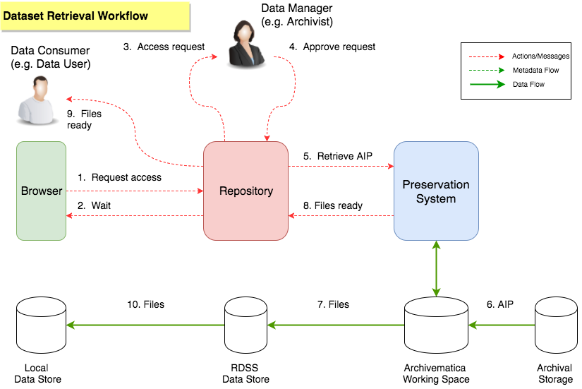

# Retrieval Workflow

In the MVP, the Datasets are likely to be small and held in online storage by the Repository/RDSS in addition to any preservation copies (AIPs) created by the Preservation System.  Therefore, if a Data Consumer wants to access the data then they can download Files from the Dataset directly from the Repository with no need to involve or interact with the Preservation System.  In this case, access can be provided instantly for public datasets and there is no need for a Data Consumer to do anything other than click on a 'Download Button' or similar.

However, for large Datasets (big files, lots of files) that are infrequently accessed or have access restrictions (e.g. they contain sensitive, confidential or private data), then it may not be cost effective or appropriate to retain all the files 'online' for instant 'public' access.  There may need to be a mediated process that controls access to some or all of the Files in a Dataset.  In this case, a Data Consumer might need to request access to a Dataset.  The Files in the Dataset are retrieved from the AIP in Archival Storage, but only if access is approved by a Data Manager at the Institution that owns the Dataset.  An example of this form of workflow is shown below.  

### Dataset Retrieval

Suppose that a Data Consumer has discovered some data that they would like to use.  For example, they may have (a) followed a dataset DOI in a publication they have read, (b) found the dataset listed in a Researcher's ORCID profile, (c) searched the [Jisc Research Data Discovery Service](https://www.jisc.ac.uk/rd/projects/uk-research-data-discovery), or they may have searched the Jisc RDSS Repository.  

Suppose that data is held in one or more AIPs that are in archival storage and it will take time to restore the data from archive so it is readily accessible to the user.

* The Data Consumer goes to the Repository (or DOI landing page) and requests access to some of the files in a Dataset. [1]

* The Repository does not have a local copy of the data because it is being held as AIPs in archival storage.

* The Repository tells the Data Consumer that the data is archived and will need to be retrieved from Archival Storage before the Data Consumer can access it.  The Data Consumer is told that they will be notified when the Files are ready for them to download. [2]

* The Repository notifies the Data Manager that the Data Consumer would like to access the data. This is an optional step and might only apply if there are privacy or cost implications.  [3]

* The Data Manager reviews the details of the request, decides that the request is valid, and approves that the Data Consumer should be given access to the Files that they want from the Dataset. [4]

* The Repository requests that the Preservation System should restore the AIP containing the Files from archival storage. [5]

* The Preservation System retrieves the AIP to its local storage. [6]

* The Preservation System extracts the required Files and copies them to the Jisc RDSS Data Store so they are accessible to the Repository. [7]

* The Preservation System notifies the Repository that the Files are ready. [8]

* The Data Consumer is notified that the Files are ready for access. [9]

* The Data Consumer downloads the Files. [10]

### Notes

The workflow above is still relatively ineffcient for big datasets containing lots of large files or large numbers of files.   Changes/improvements could include direct retrieval of files from archival storage by the Data Consumer or Repository.  However, the workflow above does have some notable features:

* The Repository does not directly mediate File downloads, rather it coordinates the process of getting data from archival storage to a download area that the user can access.  This is important when large datasets are involved because many Repository solutions don't scale well for big datasets.  This is not an issue in the MVP but could be for the Beta.

* The Repository is the single point of access control to the Dataset and can apply a range of restrictions, e.g. embargoes, rights management, checks on whether a user is a member of a host or partner institution.
    
* The data is retrieved via the Preservation System.  This allows the data to be transformed if needed by Archivematica before delivery to the user.  For example, it would allow a DIP to be created from an archived AIP.  This aligns with the way that some of the pilots expect to work, i.e. generating DIPs on demand.  This is not an issue for the MVP because it will only target datasets that have already been cleared for Open Access.

* Archivematica mediates access to the archival storage system, which is consistent with Archivematica's current approach of having a Storage Service that abstracts storage targets and is also consistent with the OAIS model.

